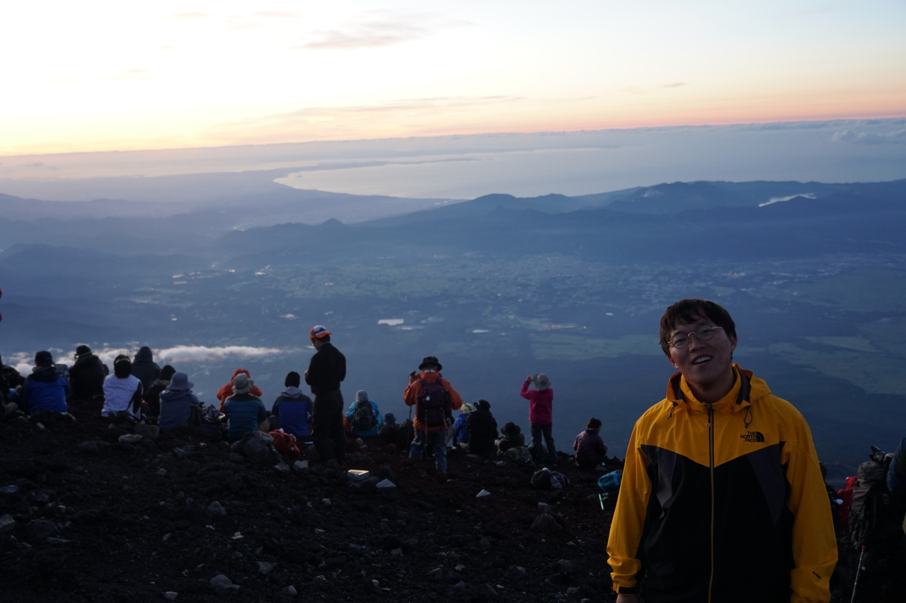

I am a South Korean young researcher living in Japan since 2008. I was majored in Engineering and especially insterested in plasma physics and controlled fusion; plasma-surface interactions; atmospheric plasma sources and its applications. I am currently working at the University of Tsukuba as an assistant professor.  
I love to watch football matches, which I try to find for a local football team there when I go abroad for experiments. I also enjoy watching e-sports matches for the League of Legends.

Grinning after climbing Mt. Fuji, in 18 Aug 2018.  

## Affiliation  

Ph.D. Engineering (Nagoya University)  
Assistant professor at  
Faculty of Pure and Applied Sciences,
Collaborative faculty at Plasma Research Center (PRC),
University of Tsukuba, Japan  
Tel: +81-29-853-7474, (sub)+81-29-853-4325  

Plasma Research Center [日本語](https://www.prc.tsukuba.ac.jp/ja/){:target="_blank"} [Eng](https://www.prc.tsukuba.ac.jp/en/){:target="_blank"}

## Find links for accomplishments

[CV](https://u.pcloud.link/publink/show?code=XZHGCrVZo6NW8Ub8528f5efKgFCxX5ctW41X){:target="_blank"}

[Google Scholar](https://scholar.google.co.jp/citations?user=7m9WB2wAAAAJ&hl=en&oi=ao){:target="_blank"}
